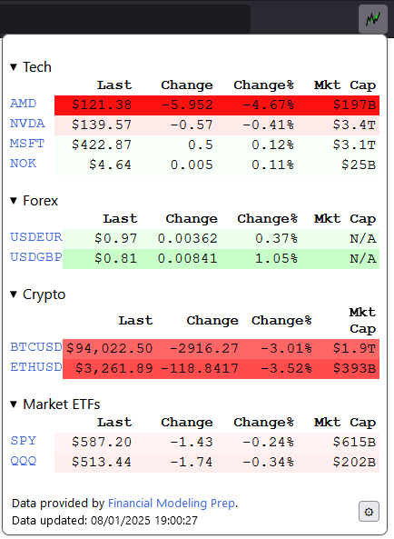

# Firestocks - Follow all your stocks in Firefox with a single click

This Firefox extension will add a button to your Firefox toolbar.
When you click on it, it will open a simple popup displaying the latest info
about the stocks you follow.

Followed stocks are set in the extension's options page.

Data is refreshed each time you open the popup.

Popup code originally inspired by https://github.com/toddwschneider/stocks.
