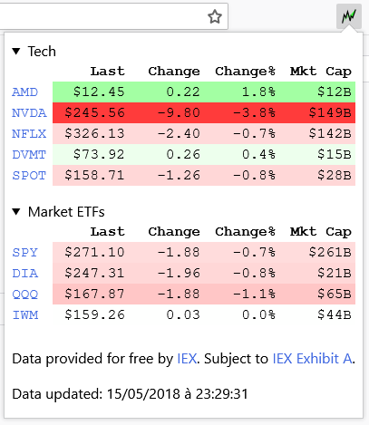

# Firestocks - Follow your stocks in Firefox with a single click

This Firefox extension adds a button to your Firefox toolbar,
which opens a simple popup displaying the latest info about the stocks you follow.

Stock data is refreshed each time you open the popup. It requires a [Financial Modeling Prep](https://site.financialmodelingprep.com/) API Key.

Followed stocks are set in the extension's options page.

FMP API also supports Forex (e.g. `EURUSD`) and Crypto (e.g. `BTCUSD`) data.

Popup code originally inspired by https://github.com/toddwschneider/stocks.
